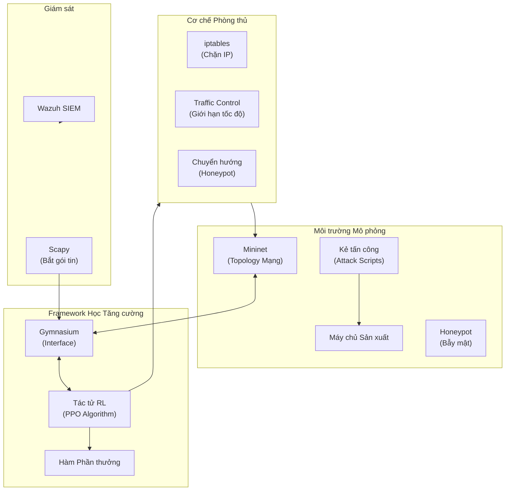
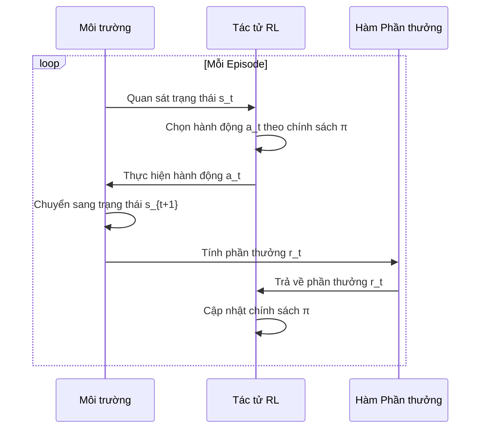

# TÓM TẮT NỘI DUNG KHÓA LUẬN TỐT NGHIỆP

## Thông tin chung

| Thông tin | Chi tiết |
|-----------|----------|
| **Tiêu đề** | An AI Agent capable of autonomous decision-making for network defense within a simulation environment |
| **Tiêu đề tiếng Việt** | Tác tử AI có khả năng tự động ra quyết định cho phòng thủ mạng trong môi trường mô phỏng |
| **Trường** | FPT University |
| **Giảng viên hướng dẫn** | Mai Hoàng Đỉnh |
| **Thời gian** | Tháng 01/2026 |

### Thành viên nhóm

| STT | Họ và Tên | Mã số sinh viên |
|-----|-----------|-----------------|
| 1 | Hồ Lê Bình | SE183564 |
| 2 | Nguyễn Hoàng Trí | SE183413 |
| 3 | Phạm Tuấn Anh | SE183403 |
| 4 | Trịnh Nguyễn Yến Vy | SE183776 |

---

## Tóm tắt (Abstract)

### Bản gốc tiếng Anh
The rapid automation and scalability of modern cyber attacks have rendered traditional rule-based security mechanisms increasingly ineffective. This study addresses these limitations by developing an Adaptive AI Defense Agent utilizing Reinforcement Learning (RL).

### Bản dịch tiếng Việt
Sự tự động hóa nhanh chóng và khả năng mở rộng của các cuộc tấn công mạng hiện đại đã khiến các cơ chế bảo mật dựa trên quy tắc truyền thống ngày càng trở nên không hiệu quả. Nghiên cứu này giải quyết những hạn chế này bằng cách phát triển một **Tác tử Phòng thủ AI Thích ứng** sử dụng **Học Tăng cường (Reinforcement Learning - RL)**.

Khác với học có giám sát truyền thống, tác tử RL được đề xuất học các chiến lược phòng thủ tối ưu thông qua tương tác tự động với môi trường mô phỏng theo cơ chế thử và sai. Dự án triển khai một mô hình mạng tùy chỉnh sử dụng **OpenAI Gymnasium** và **Mininet**, trong đó tác tử được huấn luyện để quan sát trạng thái mạng và thực hiện các hành động phòng thủ như giới hạn tốc độ, chặn, và chuyển hướng đến honeypot để tối đa hóa bảo mật hệ thống trong khi duy trì tính sẵn sàng của dịch vụ.

---

## Chương 1: GIỚI THIỆU (INTRODUCTION)

### 1.1. Bối cảnh (Background)

#### 1.1.1. Sự leo thang của các mối đe dọa mạng và tự động hóa tấn công
**Escalation of Cyber Threats and Attack Automation**

- Các cuộc tấn công mạng hiện đại không còn chủ yếu là thủ công hoặc ngẫu nhiên
- Kẻ tấn công ngày càng dựa vào các công cụ tự động để thực hiện trinh sát quy mô lớn, quét lỗ hổng, và khai thác ở tốc độ máy
- Theo báo cáo DBIR của Verizon, khoảng **68%** các vi phạm dữ liệu được xác nhận liên quan đến yếu tố con người
- Gần **30%** các vi phạm dữ liệu liên quan đến các tác nhân nội bộ

#### 1.1.2. Tác động kinh tế của vi phạm dữ liệu
**Economic Impact of Data Breaches**

- Chi phí trung bình toàn cầu của một vụ vi phạm dữ liệu đã đạt hàng triệu USD mỗi sự cố
- Chi phí bao gồm: phản hồi sự cố, khôi phục hệ thống, hình phạt pháp lý, thiệt hại danh tiếng, và mất lòng tin khách hàng

#### 1.1.3. Sự phát triển của cơ sở hạ tầng mạng và thách thức vận hành
**Evolution of Network Infrastructure and Operational Challenges**

- Công nghệ ảo hóa, container hóa, và mạng định nghĩa bằng phần mềm (SDN) mở rộng bề mặt tấn công
- Các Trung tâm Vận hành Bảo mật (SOC) thường xuyên bị quá tải bởi số lượng cảnh báo quá lớn - hiện tượng gọi là **"alert fatigue"** (mệt mỏi cảnh báo)

#### 1.1.4. Nhu cầu về hệ thống phòng thủ tự động và thích ứng
**Need for Autonomous and Adaptive Defense Systems**

- Trí tuệ Nhân tạo (AI), đặc biệt là Học Tăng cường (RL), nổi lên như một giải pháp hứa hẹn
- Tác tử RL có thể điều chỉnh hành vi động theo các mẫu tấn công đang phát triển

### 1.2. Phát biểu vấn đề (Problem Statement)

| Vấn đề | Mô tả |
|--------|-------|
| **Phản ứng thụ động** | Hầu hết các cơ chế phòng thủ mạng hiện tại phần lớn vẫn mang tính phản ứng |
| **Phụ thuộc quy tắc** | Phụ thuộc nhiều vào các quy tắc được xác định trước và sự can thiệp của con người |
| **Thiếu khả năng tự chủ** | Thiếu khả năng ra quyết định tự động |
| **Dữ liệu lỗi thời** | Các giải pháp ML thường phụ thuộc vào tập dữ liệu được gắn nhãn, nhanh chóng trở nên lỗi thời |

**Giải pháp đề xuất:** Xây dựng một tác tử phòng thủ mạng dựa trên AI sử dụng Học Tăng cường (RL) để học các chiến lược phản ứng tối ưu thông qua tương tác thử-và-sai trong môi trường mạng mô phỏng.

### 1.3. Mục tiêu nghiên cứu (Research Objectives)

1. **Nghiên cứu khả năng áp dụng** của các kỹ thuật Học Tăng cường cho việc ra quyết định tự động trong các kịch bản phòng thủ mạng

2. **Thiết kế và xây dựng** môi trường mạng mô phỏng sử dụng framework Gymnasium và Mininet

3. **Phát triển tác tử phòng thủ dựa trên RL** có khả năng quan sát trạng thái mạng, nhận diện hành vi độc hại, và chọn các hành động giảm thiểu phù hợp

4. **Định nghĩa và triển khai hàm phần thưởng** cân bằng hiệu quả bảo mật với hiệu suất hệ thống

5. **Đánh giá hiệu suất** của tác tử phòng thủ đề xuất qua nhiều kịch bản tấn công

### 1.4. Phạm vi và Giới hạn (Scope and Limitations)

#### Phạm vi nghiên cứu

**Mô phỏng tấn công (dựa trên MITRE ATT&CK):**
- Tấn công từ chối dịch vụ (DoS/DDoS): TCP SYN flood, UDP flood, HTTP flood
- Hoạt động trinh sát: quét cổng, liệt kê dịch vụ
- Tấn công web và xác thực: brute-force, SQL injection

**Cơ chế phòng thủ:**
- Chặn địa chỉ IP độc hại bằng quy tắc tường lửa
- Giới hạn tốc độ lưu lượng đáng ngờ
- Chuyển hướng lưu lượng đến honeypot

**Công nghệ sử dụng:**
- Python - ngôn ngữ lập trình chính
- Gymnasium - định nghĩa môi trường RL
- Mininet - mô phỏng topology mạng ảo
- PyTorch và Stable Baselines3 - huấn luyện mô hình RL
- Wazuh SIEM - thu thập log, trực quan hóa, giám sát

#### Giới hạn nghiên cứu

- Hệ thống chỉ được đánh giá trong môi trường mô phỏng
- Các kịch bản tấn công giới hạn ở một tập hợp được xác định trước
- Hiệu suất phụ thuộc vào chất lượng hàm phần thưởng
- Chỉ triển khai và kiểm thử trên Ubuntu Linux

### 1.5. Ý nghĩa nghiên cứu (Significance of the Study)

| Góc độ | Đóng góp |
|--------|----------|
| **Kỹ thuật** | Triển khai thực tế tác tử phòng thủ dựa trên RL tích hợp với môi trường mạng mô phỏng |
| **Học thuật** | Cung cấp hiểu biết thực nghiệm về hành vi của tác tử RL dưới các kịch bản tấn công mạng đa dạng |
| **Thực tiễn/Công nghiệp** | Giảm gánh nặng vận hành cho các nhà phân tích bảo mật, giảm thiểu alert fatigue |

---

## Chương 2: TỔNG QUAN TÀI LIỆU (LITERATURE REVIEW)

### 2.1. Nền tảng Học Tăng cường (Reinforcement Learning Fundamentals)

#### Khung Học Tăng cường (RL Framework)

Quá trình học tăng cường được mô hình hóa như tương tác giữa **tác tử (agent)** và **môi trường (environment)**:

```
Agent → Action → Environment → State + Reward → Agent
```

Được hình thức hóa bằng **Quy trình Quyết định Markov (MDP)**: $(S, A, P, R, \gamma)$

| Ký hiệu | Ý nghĩa tiếng Việt |
|---------|-------------------|
| $S$ | Tập hợp các trạng thái có thể |
| $A$ | Tập hợp các hành động khả dụng |
| $P(s'\|s,a)$ | Xác suất chuyển trạng thái |
| $R(s,a)$ | Hàm phần thưởng |
| $\gamma$ | Hệ số chiết khấu (cân bằng phần thưởng tức thời và tương lai) |

#### Học Tăng cường Sâu (Deep Reinforcement Learning)

| Phương pháp | Mô tả tiếng Việt |
|-------------|------------------|
| **Deep Q-Networks (DQN)** | Xấp xỉ hàm giá trị hành động bằng mạng neural |
| **Proximal Policy Optimization (PPO)** | Tối ưu hóa trực tiếp hàm chính sách với ràng buộc cập nhật |

**PPO** được chọn vì tính ổn định và hiệu quả mẫu, phù hợp cho phòng thủ mạng.

### 2.2. Môi trường Mô phỏng Mạng (Network Simulation Environments)

#### Vai trò của Mô phỏng trong Nghiên cứu An ninh mạng

- Cho phép thực hiện an toàn các kịch bản tấn công phá hoại
- Hỗ trợ thí nghiệm có thể lặp lại
- Cho phép so sánh công bằng giữa các thuật toán học và chính sách phòng thủ khác nhau

#### Mininet cho Mô phỏng Mạng

**Mininet** là framework mô phỏng mạng sử dụng container Linux nhẹ:
- Cung cấp hành vi mạng thực tế (độ trễ, băng thông, mất gói)
- Phù hợp cho mô phỏng topology mạng quy mô doanh nghiệp
- Tích hợp liền mạch với các công cụ bảo mật (iptables, tc)

#### Gymnasium cho Môi trường RL

**Gymnasium** (kế thừa OpenAI Gym) cung cấp giao diện chuẩn hóa cho môi trường RL:
- Định nghĩa rõ ràng không gian trạng thái, không gian hành động, hàm phần thưởng
- Tương thích với Stable Baselines3

### 2.3. Cơ chế Phản hồi Sự cố Tự động (Automated Incident Response)

#### Từ Phát hiện đến Tự động hóa Phản hồi

| Hệ thống truyền thống | Hệ thống đề xuất |
|-----------------------|------------------|
| Tập trung vào phát hiện | Tích hợp phát hiện + phản hồi |
| Cần can thiệp thủ công | Thực hiện hành động tự động |
| Chậm trễ phản hồi | Phản hồi thời gian thực |

#### Các hành động phản hồi tự động:
- **Blocking** - Chặn địa chỉ IP độc hại
- **Rate limiting** - Giới hạn tốc độ lưu lượng bất thường
- **Host isolation** - Cô lập máy chủ bị xâm nhập
- **Honeypot redirection** - Chuyển hướng kẻ tấn công đến môi trường lừa đảo

#### Cơ chế Thực thi Cấp thấp

| Công cụ | Chức năng |
|---------|-----------|
| **iptables** | Lọc gói tin và chặn kết nối chi tiết |
| **Traffic Control (tc)** | Định hình lưu lượng và giới hạn tốc độ động |

#### Kỹ thuật Lừa đảo và Honeypot

**Honeypot** (Bẫy mật): Hệ thống mồi nhử được thiết kế để thu hút kẻ tấn công và quan sát hành vi độc hại mà không gây rủi ro cho tài sản sản xuất.

### 2.4. Kỹ thuật Đặc trưng cho Lưu lượng Mạng (Feature Engineering)

#### Đặc trưng Mức Gói tin và Mức Luồng

| Loại | Tiếng Việt | Ví dụ |
|------|------------|-------|
| **Packet-level** | Mức gói tin | Địa chỉ IP nguồn/đích, loại giao thức, kích thước gói, cờ TCP |
| **Flow-level** | Mức luồng | Thời lượng kết nối, số gói, đếm byte, thời gian giữa các gói |

#### Đặc trưng Thống kê và Hành vi

- **Statistical features** (Đặc trưng thống kê): tốc độ gói, tần suất kết nối, entropy địa chỉ
- **Behavioral features** (Đặc trưng hành vi): đột biến kết nối, sử dụng giao thức bất thường, thất bại xác thực lặp lại

#### Công cụ Trích xuất Đặc trưng

**Scapy**: Framework Python để bắt gói tin và phân tích giao thức

### 2.5. Tóm tắt và Khoảng trống Nghiên cứu (Research Gap)

#### Những gì đã có:
- RL cho phòng thủ mạng thích ứng
- Môi trường mô phỏng kết hợp Mininet + Gymnasium
- Các nghiên cứu về phát hiện tấn công

#### Khoảng trống nghiên cứu:
- Thiếu hệ thống phòng thủ **vòng kín** (closed-loop) tích hợp phát hiện, ra quyết định, và thực thi
- Ít nghiên cứu xem xét tác động đến lưu lượng hợp lệ và tính sẵn sàng dịch vụ
- Hạn chế trong tích hợp với cơ chế thực thi thực tế (iptables, tc)
- Kỹ thuật lừa đảo (honeypot) thường được coi là thành phần tĩnh

**Nghiên cứu này giải quyết các khoảng trống bằng cách:** đề xuất tác tử phòng thủ AI tự động hoạt động trong môi trường mô phỏng vòng kín, tích hợp RL với mô phỏng mạng thực tế, cơ chế thực thi cấp thấp, và chiến lược phòng thủ dựa trên lừa đảo.

---

## Bảng Thuật ngữ Anh - Việt

| Thuật ngữ tiếng Anh | Thuật ngữ tiếng Việt |
|---------------------|---------------------|
| AI Agent | Tác tử AI |
| Reinforcement Learning (RL) | Học Tăng cường |
| Deep Reinforcement Learning | Học Tăng cường Sâu |
| Network Defense | Phòng thủ Mạng |
| Simulation Environment | Môi trường Mô phỏng |
| Cyber Attack | Tấn công Mạng |
| Data Breach | Vi phạm Dữ liệu |
| Intrusion Detection System (IDS) | Hệ thống Phát hiện Xâm nhập |
| Firewall | Tường lửa |
| Zero-day Attack | Tấn công Zero-day (Lỗ hổng chưa biết) |
| Security Operations Center (SOC) | Trung tâm Vận hành Bảo mật |
| Alert Fatigue | Mệt mỏi Cảnh báo |
| Denial-of-Service (DoS) | Từ chối Dịch vụ |
| Distributed DoS (DDoS) | Từ chối Dịch vụ Phân tán |
| Brute-force Attack | Tấn công Vét cạn |
| SQL Injection | Tiêm SQL |
| Port Scanning | Quét Cổng |
| Reconnaissance | Trinh sát |
| Honeypot | Bẫy mật |
| Traffic Shaping | Định hình Lưu lượng |
| Rate Limiting | Giới hạn Tốc độ |
| IP Blocking | Chặn IP |
| Markov Decision Process (MDP) | Quy trình Quyết định Markov |
| Policy | Chính sách |
| Reward Function | Hàm Phần thưởng |
| State Space | Không gian Trạng thái |
| Action Space | Không gian Hành động |
| Deep Q-Network (DQN) | Mạng Q Sâu |
| Proximal Policy Optimization (PPO) | Tối ưu hóa Chính sách Gần kề |
| Feature Engineering | Kỹ thuật Đặc trưng |
| Packet-level Features | Đặc trưng Mức Gói tin |
| Flow-level Features | Đặc trưng Mức Luồng |
| Network Emulation | Mô phỏng Mạng |
| SIEM | Quản lý Thông tin và Sự kiện Bảo mật |
| SOAR | Điều phối, Tự động hóa và Phản hồi Bảo mật |
| Closed-loop System | Hệ thống Vòng kín |
| Service Availability | Tính Sẵn sàng Dịch vụ |
| Threat Actor | Tác nhân Đe dọa |
| Attack Surface | Bề mặt Tấn công |
| Mitigation | Giảm thiểu |
| Model-free RL | RL không cần mô hình |
| Model-based RL | RL dựa trên mô hình |

---

## Sơ đồ Kiến trúc Hệ thống



---

## Quy trình Huấn luyện Tác tử



---

*Tài liệu này được tạo tự động từ file main.tex*  
*Cập nhật lần cuối: Tháng 01/2026*
